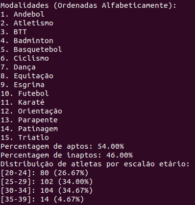

# TPC1: Processamento de CSV
**2024-02-10**

### Descrição
Neste TPC o objetivo foi processar um ficheiro CSV cujo conteúdo é introduzido a partir do stdin obtendo uma lista de modalidades ordenada alfabeticamente, a percentagem de pessoas aptas e inaptas para a prática desportiva e a distribuição de atletas por escalão etário.

### Comando de execução
```python3 csvregex.py < <filename>```

### Resultados




